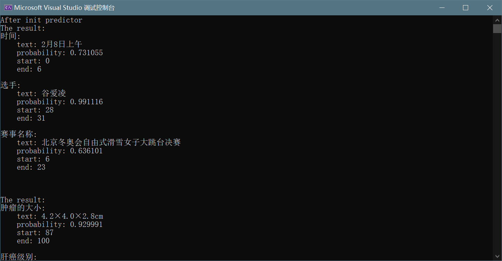

# UIE infer by ncnn
# 基于NCNN的通用抽取框架

没有下列项目，就没有本项目：
https://github.com/PaddlePaddle/FastDeploy
https://github.com/PaddlePaddle/PaddleNLP
https://github.com/HUSTAI/uie_pytorch

本项目模型导出方法
paddlepaddle->torch(transformers)->torch->pnnx->ncnn
本程序export.py主要完成后面三步

tokenizer使用paddlenlp的fasttokenizer，如果需要落地到手机端或者linux可以下载paddle的预编译包，也可以使用paddlenlp的编译脚本。

https://bj.bcebos.com/paddlenlp/fast_tokenizer/fast_tokenizer-linux-x64-1.0.2.tgz
https://bj.bcebos.com/paddlenlp/fast_tokenizer/fast_tokenizer-linux-aarch64-1.0.2.tgz
https://bj.bcebos.com/paddlenlp/fast_tokenizer/fast_tokenizer-lite-android-armeabi-v7a-1.0.2.tgz
https://bj.bcebos.com/paddlenlp/fast_tokenizer/fast_tokenizer-lite-android-arm64-v8a-1.0.2.tgz
https://bj.bcebos.com/paddlenlp/fast_tokenizer/fast_tokenizer-osx-x86_64-1.0.2.tgz
https://bj.bcebos.com/paddlenlp/fast_tokenizer/fast_tokenizer-osx-arm64-1.0.2.tgz

C++上好用的Tokenizer真的很少，原本手写的一个效果不佳，最终还是换成了百度公司开发的Tokenizer。
未来打算试着落地一下QWen 0.5B。

效果测试
